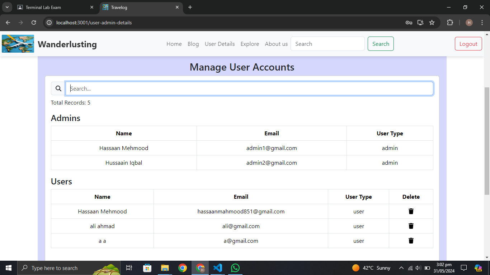

# Travelog 

It contains only Frontend.

### `Project Description:`

The platform includes the following features:

User Functionality:
  - Users can post travel blogs, which are stored in MongoDB and fetched as needed.
  - Users can add comments to posts, with data managed in MongoDB.
  - Users can like or dislike posts, with interactions saved in MongoDB.
  - Users can create polls, which are stored and retrieved from MongoDB.
  - Users can manage their personal data, stored securely in MongoDB.

Admin Functionality:
  - Admins can delete user posts, with changes reflected in MongoDB.
  - Admins can delete user accounts, with user data managed in MongoDB.
  - Admins can search users by name, utilizing MongoDB queries.

Additional Features:
  - A travel quiz for users to engage with, with data managed in MongoDB.
  - A city budget calculator to help users plan their trips.
  - Proper user authentication using JWT tokens for secure access.
  - Full responsiveness to ensure a seamless experience on all devices.

All primary functionalities are built using reusable React components to ensure a consistent and maintainable codebase.
In the project directory, you can run:

### `npm i`

It will download the all necessary modules.

### `npm start`

Runs the app in the development mode.\
Open [http://localhost:3000](http://localhost:3000) to view it in your browser.

You may also see backend response error on console in inspector.

# Travelog

Home Page

Explore Page

Sign Up Page

Sign In Page

User Home Page

Edit User Details Page 

Add Blog Post Page

All Users Blog Home Page

Blog Details Page

Admin Home Page

Admin Blog Management Page

Admin Quiz Management Page

Admin City Tour Calculator Page

