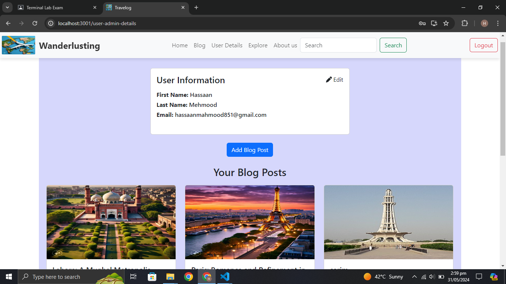

# Travelog (Only Front End) 
For complete project with Backend, contact me on this email: hassaanmahmood851@gmail.com

In the project directory, you can run:

### `npm i`

It will download the all necessary modules

### `npm start`

Runs the app in the development mode.\
Open [http://localhost:3000](http://localhost:3000) to view it in your browser.

You may also see backend response error on console in inspector

# Basic Amazone Clone

